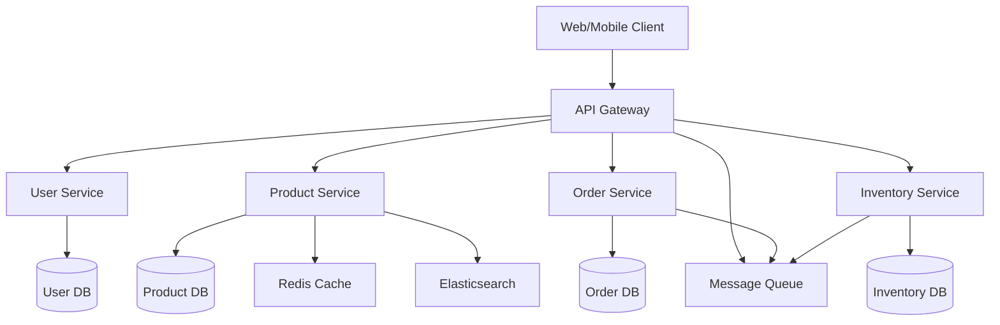

# Chapter 5: The Architect Agent

The Architect agent is your strategic system design partner, specializing in creating robust, scalable, and maintainable software architectures. This chapter explores how to leverage the Architect agent for optimal system design.

## Role and Responsibilities

### Primary Focus Areas

The Architect agent excels at:

- **System Design**: Creating high-level architectural blueprints
- **Technology Selection**: Choosing appropriate technologies and frameworks
- **Scalability Planning**: Designing systems that can grow with demand
- **Integration Strategy**: Planning how components interact
- **Security Architecture**: Designing secure system foundations
- **Performance Optimization**: Planning for optimal system performance

### Core Responsibilities

1. **Requirements Analysis**: Understanding business and technical requirements
2. **Architecture Design**: Creating comprehensive system designs
3. **Technology Evaluation**: Assessing and recommending technologies
4. **Documentation**: Creating architectural documentation
5. **Risk Assessment**: Identifying potential architectural risks
6. **Compliance**: Ensuring architectural standards compliance

## When to Use the Architect Agent

### Ideal Scenarios

Use the Architect agent when:

#### **New System Design**
```
Scenario: Building a new e-commerce platform
Input: "Design a scalable e-commerce platform for 100k daily users"
Output: Complete system architecture with microservices, database design, and infrastructure recommendations
```

#### **System Expansion**
```
Scenario: Expanding existing application
Input: "Our monolithic app needs to handle 10x current load. Plan the migration to microservices"
Output: Migration strategy, service decomposition plan, and timeline
```

#### **Technology Migration**
```
Scenario: Legacy system modernization
Input: "Migrate our PHP monolith to a modern stack. Recommend architecture and approach"
Output: Modernization roadmap, technology stack, and implementation strategy
```

#### **Performance Optimization**
```
Scenario: System performance issues
Input: "Our API response times are increasing. Analyze and redesign for better performance"
Output: Performance analysis and architectural improvements
```

### Not Ideal For

- **Implementation Details**: Use the Implementer agent for coding
- **Bug Fixes**: Use the Debugger agent for troubleshooting
- **Code Reviews**: Use the Reviewer agent for code quality
- **Testing**: Use the Tester agent for test creation

## Architect Agent Capabilities

### Design Patterns Expertise

The Architect agent has deep knowledge of:

#### **Architectural Patterns**
- Microservices Architecture
- Event-Driven Architecture
- Domain-Driven Design (DDD)
- Service-Oriented Architecture (SOA)
- Serverless Architecture
- Hexagonal Architecture

#### **Design Patterns**
- Repository Pattern
- Factory Pattern
- Observer Pattern
- Strategy Pattern
- Command Pattern
- Decorator Pattern

#### **Integration Patterns**
- API Gateway
- Message Broker
- Event Sourcing
- CQRS (Command Query Responsibility Segregation)
- Saga Pattern
- Circuit Breaker

### Technology Stack Assessment

The Architect agent evaluates technologies across:

#### **Frontend Technologies**
- React, Vue.js, Angular
- Next.js, Nuxt.js
- State management solutions
- CSS frameworks and methodologies
- Progressive Web App (PWA) technologies

#### **Backend Technologies**
- Node.js, Python, Go, Java, .NET
- Framework selection (Express, Django, Gin, Spring Boot)
- Database technologies (SQL vs NoSQL)
- Message queue systems
- Container orchestration

#### **Infrastructure Technologies**
- Cloud providers (AWS, GCP, Azure)
- Container technologies (Docker, Kubernetes)
- Serverless platforms
- CDN and caching solutions
- Monitoring and observability

## Using the Architect Agent

### Basic Usage

#### **Command Line Interface**
```bash
# Basic architecture design
opencode-setup agents execute architect \
  --task "Design a REST API for user management" \
  --context "Node.js, Express, PostgreSQL"

# Technology recommendation
opencode-setup agents execute architect \
  --task "Recommend tech stack for real-time chat app" \
  --requirements "scalable, low-latency, 10k concurrent users"

# System redesign
opencode-setup agents execute architect \
  --task "Redesign monolith to microservices" \
  --scope "user authentication, order processing, inventory"
```

#### **Interactive Mode**
```bash
# Start interactive architecture session
opencode-setup agents execute architect --interactive

# Example interaction:
> What would you like to design?
I need to design a file sharing service

> What are the key requirements?
- Support for 1M users
- File sizes up to 10GB
- Real-time collaboration
- Mobile and web apps

> Any technology preferences?
We prefer Node.js and cloud-native solutions
```

### Advanced Usage

#### **Configuration-Driven Architecture**
```bash
# Create architecture configuration
cat > arch-config.json << EOF
{
  "project": {
    "type": "saas_application",
    "scale": "enterprise",
    "users": "100000+",
    "availability": "99.9%"
  },
  "requirements": {
    "performance": {
      "response_time": "<200ms",
      "throughput": "10000 req/s"
    },
    "security": {
      "authentication": "oauth2",
      "encryption": "aes256"
    },
    "scalability": {
      "horizontal_scaling": true,
      "auto_scaling": true
    }
  },
  "constraints": {
    "budget": "moderate",
    "timeline": "6 months",
    "team_size": "8 developers"
  }
}
EOF

# Use configuration for architecture design
opencode-setup agents execute architect \
  --config arch-config.json \
  --output architecture-plan.md
```

#### **Multi-Phase Architecture**
```bash
# Phase 1: High-level design
opencode-setup agents execute architect \
  --task "Design system architecture" \
  --phase "high_level" \
  --output phase1-architecture.md

# Phase 2: Detailed design
opencode-setup agents execute architect \
  --task "Detail component design" \
  --phase "detailed" \
  --input phase1-architecture.md \
  --output phase2-architecture.md

# Phase 3: Implementation plan
opencode-setup agents execute architect \
  --task "Create implementation roadmap" \
  --phase "implementation" \
  --input phase2-architecture.md \
  --output implementation-plan.md
```

## Input and Output Examples

### Input Examples

#### **Simple Request**
```
Design a microservices architecture for an e-commerce platform
```

#### **Detailed Request**
```
Design a scalable e-commerce platform with the following requirements:
- 100k daily active users
- Support for product catalog, shopping cart, payments, user accounts
- Mobile app and web frontend
- Real-time inventory updates
- PCI compliance for payments
- Technology preference: Node.js, React, PostgreSQL, Redis
- Deployment: AWS with auto-scaling
```

#### **Context-Rich Request**
```
We need to redesign our legacy monolithic application. Current issues:
- Single database bottleneck
- Difficult to deploy individual features
- Technology stack is outdated (PHP 5.6, MySQL 5.5)
- No automated testing or deployment

Requirements for new architecture:
- Microservices approach
- CI/CD pipeline
- Modern technology stack
- 99.9% uptime requirement
- Support for 10x growth in users
- Team of 12 developers with varying skill levels
```

### Output Examples

#### **Architecture Overview**
```markdown
# E-Commerce Platform Architecture

## System Overview
- **Architecture Pattern**: Microservices with API Gateway
- **Technology Stack**: Node.js, React, PostgreSQL, Redis, Docker
- **Infrastructure**: AWS EKS, RDS, ElastiCache, CloudFront
- **Scalability**: Horizontal auto-scaling with load balancing

## Core Services
1. **User Service**: Authentication, authorization, profile management
2. **Product Service**: Catalog management, search, recommendations
3. **Order Service**: Cart management, order processing, payment integration
4. **Inventory Service**: Stock management, real-time updates
5. **Notification Service**: Email, SMS, push notifications

## Data Architecture
- **Primary Database**: PostgreSQL with read replicas
- **Caching Layer**: Redis for session and product data
- **Search Engine**: Elasticsearch for product search
- **File Storage**: S3 for images and documents
```

#### **Component Diagram**


#### **Technology Recommendations**
```markdown
## Technology Stack Recommendations

### Backend Services
- **Runtime**: Node.js 18+ with TypeScript
- **Framework**: Express.js with middleware architecture
- **Database**: PostgreSQL 14+ with connection pooling
- **ORM**: Prisma for type-safe database access
- **Authentication**: JWT with refresh tokens

### Frontend Applications
- **Web**: React 18 with Next.js 13
- **Mobile**: React Native with Expo
- **State Management**: Redux Toolkit with RTK Query
- **UI Components**: Material-UI (MUI)

### Infrastructure
- **Containerization**: Docker with multi-stage builds
- **Orchestration**: Kubernetes with Helm charts
- **CI/CD**: GitHub Actions with ArgoCD
- **Monitoring**: Prometheus + Grafana + Jaeger
```

## Best Practices for Architect Agent

### Providing Good Input

#### **✅ Good Input Examples**
```
Design a task management system for:
- 50k users
- Real-time collaboration
- Mobile and web apps
- Technology: Python, Django, PostgreSQL
- Deployment: AWS with auto-scaling
```

#### **❌ Poor Input Examples**
```
Design an app
```

### Structuring Requirements

Use the following structure for best results:

```markdown
## Project Context
[Brief description of the project and business goals]

## Functional Requirements
[List of features and capabilities]

## Non-Functional Requirements
[Performance, security, scalability requirements]

## Technical Constraints
[Technology preferences, team skills, budget limitations]

## Business Constraints
[Timeline, team size, regulatory requirements]
```

### Reviewing Architect Output

When reviewing the Architect agent's output:

1. **Validate Requirements**: Ensure all requirements are addressed
2. **Check Feasibility**: Verify the proposed solution is achievable
3. **Assess Trade-offs**: Understand the decisions and alternatives
4. **Review Integration**: Ensure components work together properly
5. **Plan Implementation**: Create actionable next steps

## Integration with Other Agents

### Typical Workflow Sequence

1. **Researcher** (optional): Research requirements and best practices
2. **Architect**: Design system architecture
3. **Implementer**: Implement based on architectural design
4. **Tester**: Create tests for the implemented system
5. **Reviewer**: Review implementation against architecture
6. **Documenter**: Document the final system

### Handoff Patterns

#### **Architect → Implementer**
The Architect provides:
- System design documents
- Component specifications
- API contracts
- Database schemas
- Technology recommendations

#### **Architect → Reviewer**
The Architect provides:
- Architecture principles
- Design decisions documentation
- Trade-off analysis
- Compliance requirements

## Common Use Cases

### **Use Case 1: Startup MVP Architecture**

**Input**: "Design MVP architecture for social media app"

**Output**:
- Monolithic architecture for rapid development
- Simple database design
- Basic authentication system
- Deployment on single server
- Migration path to microservices

### **Use Case 2: Enterprise System Integration**

**Input**: "Integrate three legacy systems into unified platform"

**Output**:
- API Gateway pattern
- Message broker for async communication
- Data synchronization strategy
- Security integration approach
- Phased migration plan

### **Use Case 3: Performance Optimization**

**Input**: "Optimize architecture for 100x traffic growth"

**Output**:
- Caching strategy
- Database optimization
- Load balancing configuration
- CDN implementation
- Auto-scaling policies

## Troubleshooting

### Common Issues

#### **Issue: Vague Requirements**
**Problem**: Insufficient detail leads to generic architecture
**Solution**: Provide detailed requirements and constraints

#### **Issue: Technology Mismatch**
**Problem**: Recommended technologies don't fit team skills
**Solution**: Include team capabilities and learning curve considerations

#### **Issue: Over-Engineering**
**Problem**: Complex architecture for simple requirements
**Solution**: Focus on YAGNI (You Aren't Gonna Need It) principle

#### **Issue: Missing Constraints**
**Problem**: Architecture ignores budget or timeline constraints
**Solution**: Clearly specify all business and technical constraints

### Getting Better Results

1. **Provide Context**: Include business goals and constraints
2. **Specify Scale**: Define expected user load and growth
3. **List Technologies**: Include current stack and preferences
4. **Define Timeline**: Specify development and deployment timeline
5. **Team Assessment**: Describe team skills and experience level

## Advanced Features

### **Architecture Patterns Library**
```bash
# Browse available patterns
opencode-setup agents execute architect --list-patterns

# Apply specific pattern
opencode-setup agents execute architect \
  --pattern "microservices" \
  --context "e-commerce platform"
```

### **Technology Comparison**
```bash
# Compare technologies
opencode-setup agents execute architect \
  --task "Compare databases for high-write workload" \
  --compare "postgresql,mongodb,cassandra"
```

### **Cost Estimation**
```bash
# Estimate infrastructure costs
opencode-setup agents execute architect \
  --task "Estimate AWS costs for proposed architecture" \
  --duration "monthly" \
  --region "us-east-1"
```

## Summary

The Architect agent is your strategic partner for:

- **System Design**: Creating robust, scalable architectures
- **Technology Selection**: Making informed technology decisions
- **Strategic Planning**: Planning for growth and evolution
- **Risk Mitigation**: Identifying and addressing architectural risks

By providing clear requirements and context, you can leverage the Architect agent to create designs that serve your project's needs both now and in the future.

The key to success with the Architect agent is providing detailed, structured input and carefully reviewing the output to ensure it meets all your requirements and constraints.
